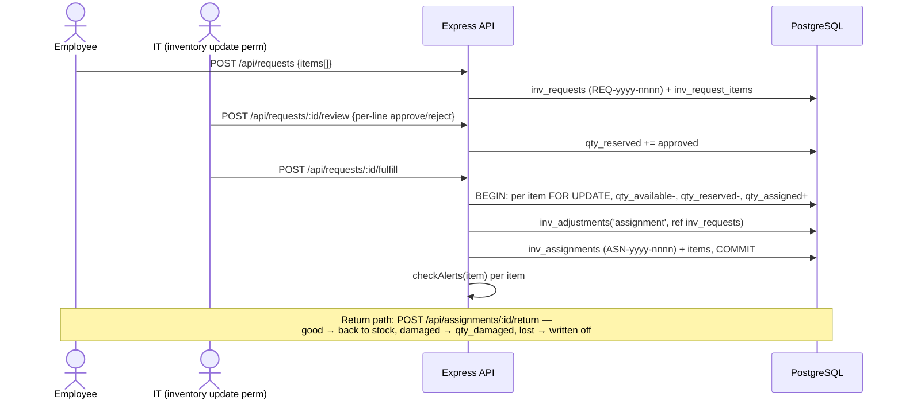
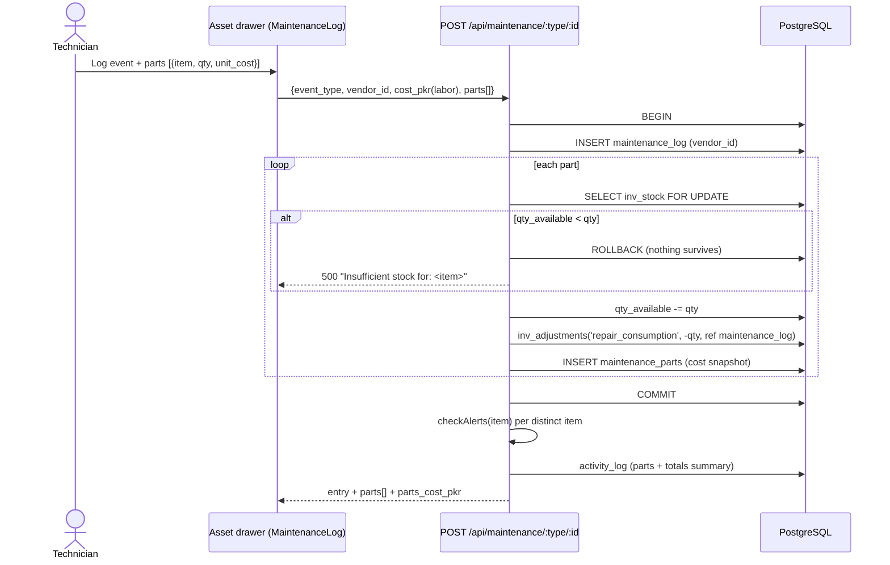

# IT Stock Inventory & Spare Parts Management — Architecture

**Status:** Phase 1 (repair ↔ parts consumption) implemented. Phases 2–4 are design-only until
scheduled.
**Scope decision (2026-08-09):** extend the existing `inv_*` schema — never a parallel schema. All
DDL lands in `runMigrations()` (`backend/src/server.js`) as `IF NOT EXISTS` statements, per project
convention.

This document is the blueprint for managing a central IT stock room holding both high-value
repairable parts (screens, batteries, mainboards) and high-volume consumables (cables, mice,
keyboards, headsets), on top of what ITMS already does.

---

## 1. Gap analysis

ITMS already implements the majority of a stock/spares system. The design below adds only what is
missing.

| Capability | Exists today | Gap this design closes |
| --- | --- | --- |
| Consumable stock | `inv_items` / `inv_stock` (one stock row per item, `UNIQUE(item_id)`), append-only `inv_adjustments` movement ledger, six manual adjustment types | No serialized per-unit tracking, no bin/shelf locations, no unit cost anywhere in the catalog |
| Issue lifecycle | Full request → approve (reserves) → fulfil (assigns) → return (good/damaged/lost) flow with `ASN-`/`RET-` numbering; direct assignment; per-employee ledger | No consumption thresholds per employee ("more than 2 chargers in 90 days"), no anomaly flagging |
| Reorder | `inv_stock.reorder_level` drives write-triggered `checkAlerts()` (`routes/inventory.js:21-48`) with SQL-level dedup and auto-resolve; `/api/reports/forecast` projects stockout dates | `reorder_qty` is stored but consumed by no logic; alerts fire only on stock *writes* (no sweep); delivery is a 60-second frontend poll — no email, no webhook |
| Repairs | `maintenance_log` per system/mobile with event vocabulary incl. `replaced_part`, single `cost_pkr` scalar, free-text `performed_by`; rendered by `MaintenanceLog.jsx` in the asset drawer | **A repair cannot record which parts it consumed.** Stock is not decremented, parts carry no cost, `vendors` is referenced by nothing, and no per-asset cost rollup exists |
| Labels | QR generation + 2.2×2.8 cm label print (`QRModal.jsx`) for systems/mobiles/network | Payload is display text, not a scannable lookup; no QR for stock items or units; no scanning |

## 2. ER extensions

Written exactly as they appear (or will appear) in `runMigrations()`.

### 2a. Phase 1 — repair ↔ parts consumption (IMPLEMENTED)

```sql
CREATE TABLE IF NOT EXISTS maintenance_parts (
  id                 SERIAL PRIMARY KEY,
  maintenance_log_id INTEGER NOT NULL REFERENCES maintenance_log(id) ON DELETE CASCADE,
  item_id            INTEGER NOT NULL REFERENCES inv_items(id),
  qty                INTEGER NOT NULL DEFAULT 1 CHECK (qty > 0),
  unit_cost_pkr      NUMERIC(10,2),          -- snapshot at consumption time
  serial_no          VARCHAR(100),           -- free text; becomes FK to inv_units in Phase 2
  notes              TEXT,
  created_at         TIMESTAMPTZ NOT NULL DEFAULT NOW()
);
CREATE INDEX IF NOT EXISTS idx_maint_parts_log  ON maintenance_parts(maintenance_log_id);
CREATE INDEX IF NOT EXISTS idx_maint_parts_item ON maintenance_parts(item_id);

ALTER TABLE maintenance_log
  ADD COLUMN IF NOT EXISTS vendor_id INTEGER REFERENCES vendors(id) ON DELETE SET NULL;
```

Design decisions, and why:

- **`unit_cost_pkr` is a snapshot**, not a lookup. A later price change in the catalog must never
  reprice a past repair. (Until Phase 3 adds `last_unit_cost_pkr`, the technician types the cost or
  leaves it null.)
- **Total parts cost is computed, never stored** — `SUM(qty * unit_cost_pkr)` at read time. A
  denormalised total would drift.
- **`maintenance_log.cost_pkr` is redefined as the labor/service cost.** Total repair cost =
  `cost_pkr + parts cost`. Entries written before Phase 1 used it for "everything"; the UI labels
  the field "Labor / service cost" so old rows are read correctly.
- **`vendor_id` is nullable and coexists with the legacy free-text `performed_by`** — no backfill,
  nothing breaks. This is the first table to actually reference `vendors`.
- **Every consumption writes the `inv_adjustments` ledger** with
  `type='repair_consumption', reference_type='maintenance_log', reference_id=<log id>`, so the
  ledger remains the single source of truth for stock movements. Deleting a repair with restock
  writes a *compensating* `repair_restock` row — ledger rows are never deleted.

### 2b. Phase 2 — serialized units + bin locations (design only)

```sql
CREATE TABLE IF NOT EXISTS inv_bins (
  id          SERIAL PRIMARY KEY,
  code        VARCHAR(30) UNIQUE NOT NULL,      -- e.g. "R2-S4" (rack 2, shelf 4)
  location    VARCHAR(100),                     -- room / site
  description TEXT,
  is_active   BOOLEAN NOT NULL DEFAULT true,
  created_at  TIMESTAMPTZ NOT NULL DEFAULT NOW()
);

CREATE TABLE IF NOT EXISTS inv_units (
  id                   SERIAL PRIMARY KEY,
  item_id              INTEGER NOT NULL REFERENCES inv_items(id),
  serial_no            VARCHAR(100) NOT NULL,
  status               VARCHAR(20) NOT NULL DEFAULT 'in_stock'
                       CHECK (status IN ('in_stock','reserved','installed','faulty','rma','scrapped')),
  bin_id               INTEGER REFERENCES inv_bins(id) ON DELETE SET NULL,
  cost_pkr             NUMERIC(10,2),
  installed_asset_type VARCHAR(20),             -- soft-FK mirroring maintenance_log
  installed_asset_id   INTEGER,
  maintenance_part_id  INTEGER REFERENCES maintenance_parts(id) ON DELETE SET NULL,
  notes                TEXT,
  created_at           TIMESTAMPTZ NOT NULL DEFAULT NOW(),
  updated_at           TIMESTAMPTZ NOT NULL DEFAULT NOW(),
  UNIQUE (item_id, serial_no)
);

-- widen tracking_type (drop/re-add pattern used throughout runMigrations)
ALTER TABLE inv_items DROP CONSTRAINT IF EXISTS inv_items_tracking_type_check;
ALTER TABLE inv_items ADD CONSTRAINT inv_items_tracking_type_check
  CHECK (tracking_type IN ('quantity','quantity_returnable','serialized'));

ALTER TABLE inv_stock ADD COLUMN IF NOT EXISTS bin_id INTEGER REFERENCES inv_bins(id);
```

Architectural rule: **serialized items keep their `inv_stock` row**, with `qty_available`
maintained as the count of `in_stock` units. `checkAlerts`, `/forecast`, and every existing report
keep working unchanged. `inv_stock.bin_id` gives bulk consumables one home bin each
(`UNIQUE(item_id)` stays); if multi-bin stock is ever needed, an `inv_stock_bins` junction replaces
that column — not before.

QR: unit labels encode a lookup URL (`https://<host>/inventory/units/<id>`) instead of display
text, so scanning any phone camera resolves to the record. `QRModal.jsx` already prints
2.2×2.8 cm labels; only the payload builder changes, no new library. Bulk-consumable bins get one
SKU-level label per bin (`/inventory/items/<id>`).

### 2c. Phase 3 — procurement + reorder automation (design only)

```sql
CREATE SEQUENCE IF NOT EXISTS inv_po_seq START 1;
CREATE TABLE IF NOT EXISTS inv_purchase_orders (
  id            SERIAL PRIMARY KEY,
  po_number     VARCHAR(30) UNIQUE NOT NULL,     -- PO-<year>-nnnn
  vendor_id     INTEGER REFERENCES vendors(id),
  status        VARCHAR(30) NOT NULL DEFAULT 'draft'
                CHECK (status IN ('draft','ordered','partially_received','received','cancelled')),
  expected_date DATE,
  notes         TEXT,
  created_by    INTEGER REFERENCES users(id) ON DELETE SET NULL,
  created_at    TIMESTAMPTZ NOT NULL DEFAULT NOW(),
  updated_at    TIMESTAMPTZ NOT NULL DEFAULT NOW()
);
CREATE TABLE IF NOT EXISTS inv_po_items (
  id            SERIAL PRIMARY KEY,
  po_id         INTEGER NOT NULL REFERENCES inv_purchase_orders(id) ON DELETE CASCADE,
  item_id       INTEGER NOT NULL REFERENCES inv_items(id),
  qty_ordered   INTEGER NOT NULL CHECK (qty_ordered > 0),
  unit_cost_pkr NUMERIC(10,2)
);
CREATE SEQUENCE IF NOT EXISTS inv_grn_seq START 1;
CREATE TABLE IF NOT EXISTS inv_goods_receipts (
  id          SERIAL PRIMARY KEY,
  grn_number  VARCHAR(30) UNIQUE NOT NULL,       -- GRN-<year>-nnnn
  po_id       INTEGER REFERENCES inv_purchase_orders(id),  -- nullable: ad-hoc receipt
  invoice_no  VARCHAR(100),
  received_by INTEGER REFERENCES users(id) ON DELETE SET NULL,
  received_at TIMESTAMPTZ NOT NULL DEFAULT NOW(),
  notes       TEXT
);
CREATE TABLE IF NOT EXISTS inv_grn_items (
  id            SERIAL PRIMARY KEY,
  grn_id        INTEGER NOT NULL REFERENCES inv_goods_receipts(id) ON DELETE CASCADE,
  item_id       INTEGER NOT NULL REFERENCES inv_items(id),
  qty           INTEGER NOT NULL CHECK (qty > 0),
  unit_cost_pkr NUMERIC(10,2),
  bin_id        INTEGER REFERENCES inv_bins(id)
);

ALTER TABLE inv_items  ADD COLUMN IF NOT EXISTS last_unit_cost_pkr  NUMERIC(10,2);
ALTER TABLE inv_items  ADD COLUMN IF NOT EXISTS preferred_vendor_id INTEGER REFERENCES vendors(id);
ALTER TABLE inv_alerts ADD COLUMN IF NOT EXISTS notified_at TIMESTAMPTZ;
```

Behavior:

- Posting a receipt writes `inv_adjustments` rows
  (`type='purchase', reference_type='goods_receipt', reference_id=grn.id`) — the ledger stays the
  single source of truth. (Today's only restock path, the manual adjust endpoint, remains for
  corrections.)
- Receipt also updates `inv_items.last_unit_cost_pkr`, which the Phase 1 parts picker then uses to
  pre-fill `unit_cost_pkr`.
- The dormant **`reorder_qty` finally becomes live**: the nightly sweep proposes one draft-PO line
  of `reorder_qty` per breached item, grouped by `preferred_vendor_id`.
- **Scheduler**: a sibling of `scheduleWeeklyMaintenance()` (`server.js` — self-rearming
  `setTimeout`, armed only under `require.main === module` so tests never start it). A nightly
  sweep runs the §4.3 query, opens missing alerts, and dispatches notifications, stamping
  `inv_alerts.notified_at` so nothing is sent twice.
- **Delivery**: `nodemailer` with `SMTP_HOST/SMTP_PORT/SMTP_USER/SMTP_PASS/ALERT_EMAIL_TO` env
  vars; optional `ALERT_WEBHOOK_URL` receiving a JSON POST. Absent config = dashboard-only, exactly
  today's behavior.

Note: `routes/purchases.js` / `asset_purchases` is **employee buyout of used hardware (outbound)**
— unrelated to procurement. The naming is close; the modules must stay separate.

### 2d. Phase 4 — consumption anomaly rules (design only)

```sql
CREATE TABLE IF NOT EXISTS inv_anomaly_rules (
  id          SERIAL PRIMARY KEY,
  item_id     INTEGER REFERENCES inv_items(id)      ON DELETE CASCADE,  -- either item...
  category_id INTEGER REFERENCES inv_categories(id) ON DELETE CASCADE,  -- ...or category
  max_qty     INTEGER NOT NULL CHECK (max_qty > 0),
  window_days INTEGER NOT NULL DEFAULT 90 CHECK (window_days > 0),
  severity    VARCHAR(10) NOT NULL DEFAULT 'warning' CHECK (severity IN ('info','warning','critical')),
  is_active   BOOLEAN NOT NULL DEFAULT true,
  CHECK (item_id IS NOT NULL OR category_id IS NOT NULL)
);

ALTER TABLE inv_alerts ADD COLUMN IF NOT EXISTS employee_id INTEGER REFERENCES employees(id);
ALTER TABLE inv_alerts ADD COLUMN IF NOT EXISTS details JSONB;
```

An item-level rule wins over a category rule. The nightly sweep evaluates each employee's issued
quantities (from `inv_assignment_items` joined through `inv_assignments`) inside each rule's
window; a breach opens an `inv_alerts` row with `alert_type='consumption_anomaly'`, the
`employee_id`, and the evidence in `details` (e.g. `{"item":"USB-C Charger","qty":3,"window_days":90}`).
Example rule fulfilling the classic case: chargers, `max_qty=2`, `window_days=90`.

## 3. Workflows

### 3.1 Issue consumable to employee (existing flow, annotated)



### 3.2 Repair with parts consumption (Phase 1 — implemented)



### 3.3 Threshold breach → reorder (Phase 3 target state)

```mermaid
flowchart TD
    W[Any stock write] --> C{checkAlerts:\nqty_available <= reorder_level?}
    S[Nightly sweep\nsame predicate, catches\nnon-write changes] --> C
    C -- no --> R[Auto-resolve open alerts\nif stock recovered]
    C -- yes --> A[inv_alerts row\ndedup on unresolved same type]
    A --> N[Notifier: email + webhook\nstamp notified_at]
    N --> D[Dashboard bell / banner\n(exists today)]
    N --> PO[Draft PO line:\nreorder_qty @ preferred vendor]
    PO --> ORD[PO ordered] --> GRN[Goods receipt]
    GRN --> L[inv_adjustments 'purchase'\nref goods_receipt]
    L --> C
```

## 4. Core queries

### 4.1 Employee asset & consumption report

Active holdings per employee, hardware replacement count (12 months), and anomaly flags (Phase 4
rules; until then the LATERAL can be dropped).

```sql
SELECT e.id, e.full_name, e.department,
       held.items_in_hand, held.open_assignments,
       COALESCE(rep.replacements_12m, 0) AS replacements_12m,
       anom.flags AS anomaly_flags
FROM employees e
LEFT JOIN LATERAL (
  SELECT COALESCE(SUM(ai.qty), 0) AS items_in_hand,
         COUNT(DISTINCT a.id)     AS open_assignments
  FROM inv_assignments a
  JOIN inv_assignment_items ai ON ai.assignment_id = a.id AND ai.status = 'active'
  WHERE a.assignee_id = e.id AND a.status != 'fully_returned'
) held ON true
LEFT JOIN LATERAL (
  SELECT COUNT(*) AS replacements_12m
  FROM asset_history h
  WHERE h.event_type = 'replaced' AND h.to_employee_id = e.id
    AND h.created_at > NOW() - INTERVAL '12 months'
) rep ON true
LEFT JOIN LATERAL (                         -- Phase 4: rules-driven anomaly evaluation
  SELECT json_agg(json_build_object('item', i.name, 'qty', x.qty,
                                    'max', r.max_qty, 'window_days', r.window_days)) AS flags
  FROM inv_anomaly_rules r
  JOIN inv_items i ON i.id = r.item_id
  JOIN LATERAL (
    SELECT COALESCE(SUM(ai.qty), 0) AS qty
    FROM inv_assignments a
    JOIN inv_assignment_items ai ON ai.assignment_id = a.id
    WHERE a.assignee_id = e.id AND ai.item_id = r.item_id
      AND a.assigned_date > CURRENT_DATE - r.window_days
  ) x ON x.qty > r.max_qty
  WHERE r.is_active
) anom ON true
WHERE e.is_active
ORDER BY replacements_12m DESC, e.full_name;
```

### 4.2 Laptop health & maintenance history by serial number

This is exactly the query behind `GET /api/maintenance/system/:id` (Phase 1), keyed here by serial.

```sql
SELECT s.asset_tag, s.serial_number, s.manufacturer, s.model,
       m.event_date, m.event_type, m.performed_by, v.name AS vendor_name,
       m.cost_pkr                                            AS labor_cost_pkr,
       COALESCE(p.parts_cost, 0)                             AS parts_cost_pkr,
       m.cost_pkr + COALESCE(p.parts_cost, 0)                AS event_total_pkr,
       COALESCE(p.parts, '[]'::json)                         AS parts,
       m.notes,
       SUM(COALESCE(m.cost_pkr,0) + COALESCE(p.parts_cost,0))
         OVER (PARTITION BY s.id)                            AS lifetime_repair_cost_pkr
FROM systems s
JOIN maintenance_log m ON m.asset_type = 'system' AND m.asset_id = s.id
LEFT JOIN vendors v ON v.id = m.vendor_id
LEFT JOIN LATERAL (
  SELECT json_agg(json_build_object('item', i.name, 'qty', mp.qty,
                                    'unit_cost_pkr', mp.unit_cost_pkr,
                                    'serial_no', mp.serial_no) ORDER BY mp.id) AS parts,
         SUM(mp.qty * COALESCE(mp.unit_cost_pkr, 0))                           AS parts_cost
  FROM maintenance_parts mp
  JOIN inv_items i ON i.id = mp.item_id
  WHERE mp.maintenance_log_id = m.id
) p ON true
WHERE s.serial_number = $1
ORDER BY m.event_date DESC, m.created_at DESC;
```

### 4.3 Automated low-stock warning sweep

Same dedup predicate as `checkAlerts`; consumption velocity borrowed from `/api/reports/forecast`.
Run nightly (Phase 3) — write-triggered `checkAlerts` stays as the fast path.

```sql
SELECT i.id, i.name, i.sku, c.name AS category,
       st.qty_available, st.reorder_level, st.reorder_qty AS suggested_order_qty,
       ROUND(u.avg_daily, 2) AS avg_daily_consumption,
       CASE WHEN u.avg_daily > 0
            THEN FLOOR(st.qty_available / u.avg_daily)
       END AS days_until_stockout
FROM inv_stock st
JOIN inv_items i        ON i.id = st.item_id AND i.is_active
LEFT JOIN inv_categories c ON c.id = i.category_id
LEFT JOIN LATERAL (
  SELECT COALESCE(-SUM(a.qty_change), 0) / 90.0 AS avg_daily
  FROM inv_adjustments a
  WHERE a.item_id = i.id AND a.qty_change < 0
    AND a.created_at > NOW() - INTERVAL '90 days'
) u ON true
WHERE st.qty_available <= st.reorder_level
  AND NOT EXISTS (
    SELECT 1 FROM inv_alerts al
    WHERE al.item_id = i.id AND al.is_resolved = false
      AND al.alert_type = CASE WHEN st.qty_available = 0
                               THEN 'out_of_stock' ELSE 'low_stock' END
  )
ORDER BY days_until_stockout NULLS LAST, st.qty_available;
```

## 5. Dashboard KPIs & stack

**KPIs for the IT Asset Manager** (most are one query against existing tables):

- Items at/below reorder level; items out of stock (exists — `/api/inventory/stats`)
- Average days-until-stockout across low items (§4.3)
- MTD repair spend, split labor (`cost_pkr`) vs parts (`maintenance_parts`) — new in Phase 1
- Top 5 consumed parts, last 30 days (`inv_adjustments` where `type='repair_consumption'`)
- Top 10 assets by lifetime repair cost (candidates for replacement over repair)
- Replacements per employee, 90 days (`/api/asset-history/stats/replacements` exists)
- Open consumption-anomaly flags (Phase 4)
- Stock valuation (needs Phase 3 costs); PO cycle time order→receipt (Phase 3)

**Tech stack recommendation — extend ITMS, no new stack.** The system is a working
Express + pg + React 18 + Bootstrap app with auth, RBAC, audit trail, recycle bin, tests and CI.
A low-code tool or greenfield rewrite would re-implement all of that for zero functional gain.
The only genuinely new infrastructure, deferred to Phase 3, is:

- a **scheduler** — sibling of the existing `scheduleWeeklyMaintenance()` self-rearming timer
  (armed only under `require.main === module`, so tests never run it); `node-cron` only if real
  cron expressions become necessary;
- **outbound notifications** — `nodemailer` + `SMTP_*`/`ALERT_EMAIL_TO` env vars, optional
  `ALERT_WEBHOOK_URL`; unset config degrades to today's dashboard-only behavior;
- **scanning** (Phase 2) — no new library needed: switch QR payloads from display text to lookup
  URLs and any phone camera becomes the scanner.

## 6. Phased roadmap

| Phase | Contents | Status |
| --- | --- | --- |
| 1 | `maintenance_parts` + `vendor_id`; POST/GET/DELETE maintenance carry parts, decrement stock through the ledger, cost rollups in the asset drawer; maintenance widened to network devices; tests | **Implemented** |
| 2 | `inv_bins`, `inv_units`, `tracking_type='serialized'`, unit lifecycle, QR lookup URLs, bin labels | Designed (§2b) |
| 3 | Purchase orders, goods receipts, unit costs, live `reorder_qty` suggestions, nightly sweep, email/webhook delivery | Designed (§2c) |
| 4 | Anomaly rules + employee consumption flags in alerts and reports | Designed (§2d) |

Phase order rationale: 1 unblocks cost visibility with zero new infrastructure; 2 and 3 are
independent of each other; 4 is a small delta once 3's sweep exists.
