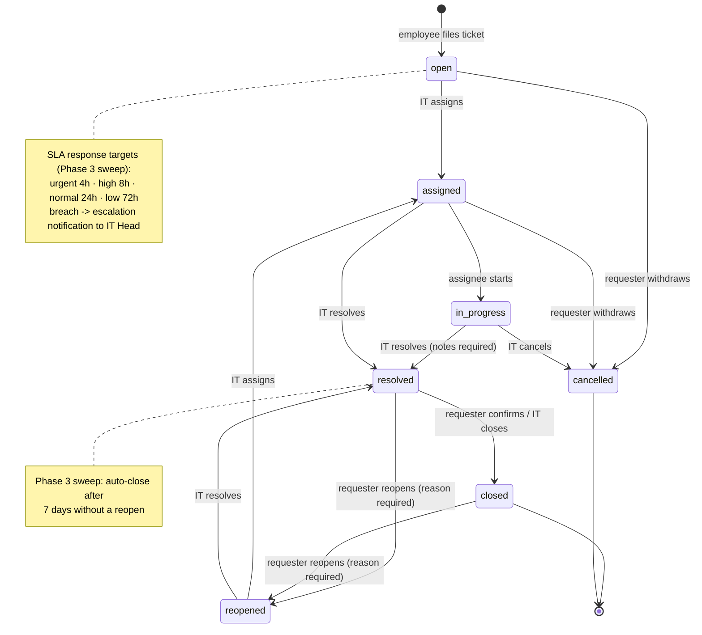
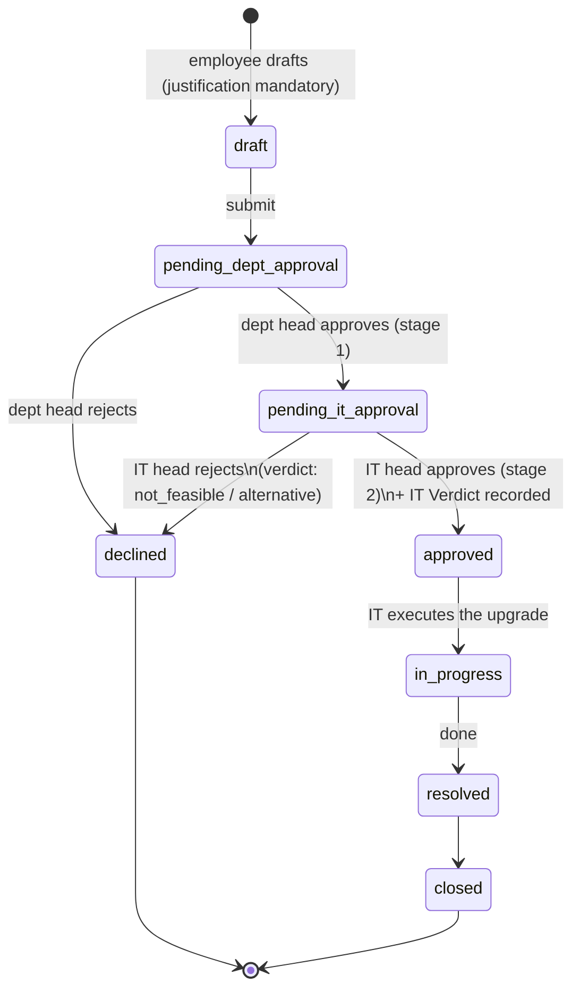

# User Complaint & IT Request Module — Architecture

**Status:** Phase 1 (complaint ticketing + employee self-service accounts) implemented.
Phases 2–3 are design-only until scheduled.
**Scope decisions (2026-08-09):** extend the existing schema — all DDL in `runMigrations()`
(`backend/src/server.js`), never a parallel schema. Accessory requests are **not** rebuilt: the
existing `inv_requests` flow already covers them (§7). Authentication stays **local
email + password** for now; Google OAuth SSO is a documented go-live cutover (§6), not a Phase 1
build — the previous "Google OAuth @bykea.com" claims in this repo were never real and were removed
in PRs #11–#14.

---

## 1. Gap analysis / requirement mapping

| Requirement | Exists today | Gap this design closes |
| --- | --- | --- |
| IT complaint ticketing | Nothing — no tickets, no comments table anywhere | New `support_tickets` + `ticket_comments`, `BYK-TICK-` numbering, lifecycle, IT queue (Phase 1) |
| Accessory requests w/ stock deduction | **Fully covered** by `inv_requests`: submit → review (reserves stock) → fulfill (deducts + creates `ASN-` assignment) | Employee role gains access; three read-scoping holes fixed (§7) |
| Hardware upgrade two-tier approval | No department-head/manager concept anywhere (`heads`/`sub_heads` are *cost* heads) | Phase 2: `department_heads`, `approval_roles`, `ticket_approvals`, IT Verdict (§2b) |
| RBAC / SSO / dynamic UI | 3 roles (`super_admin`/`user`/`viewer`) + per-module `user_permissions`; local auth; `users.google_id` column exists but no OAuth strategy | New `employee` role with a hard whitelist; SSO documented for go-live (§6) |
| Notifications / email | None — no SMTP, no webhook, only two 60-second UI polls | Phase 3: `notifications` table + nodemailer plan (§2c, §6) |

**Known warts inherited (documented, not fixed here):**
- The grantable-module whitelist is duplicated in `backend/src/routes/users.js` (`MODULES`) and
  `frontend/src/pages/UserManagement.jsx` (`MODULES`) — and the backend list silently drops
  `inventory`/`vendors`/`masterdata` grants on save. Both lists gained `support` in Phase 1; the
  older discrepancy remains.
- `hasPerm()` returns true for `action === 'read'` for every authenticated role. That is why the
  `employee` role is a **whitelist checked before that rule**, and why a request-path gate in
  `server.js` additionally fences employees off the requireAuth-only read routes.
- The `viewer` role exists in the schema but the create-user endpoint does not offer it.
- An employee who types `/systems` into the URL sees the page shell render, but every API call
  answers 403 and the navigation never offers the link. Accepted for Phase 1.

## 2. Schema

### 2a. Phase 1 (IMPLEMENTED — DDL verbatim from `runMigrations()`)

```sql
ALTER TABLE users DROP CONSTRAINT IF EXISTS users_role_check;
ALTER TABLE users ADD CONSTRAINT users_role_check
  CHECK (role IN ('super_admin','user','viewer','employee'));
ALTER TABLE users ADD COLUMN IF NOT EXISTS must_change_password BOOLEAN NOT NULL DEFAULT false;

CREATE SEQUENCE IF NOT EXISTS support_ticket_seq START 1;
CREATE TABLE IF NOT EXISTS support_tickets (
  id                    SERIAL PRIMARY KEY,
  ticket_number         VARCHAR(30) UNIQUE NOT NULL,          -- BYK-TICK-2026-0001
  category              VARCHAR(30) NOT NULL CHECK (category IN
                        ('hardware_fault','performance','os','software','network','printer','email_gws')),
  priority              VARCHAR(20) NOT NULL DEFAULT 'normal'
                        CHECK (priority IN ('low','normal','high','urgent')),
  status                VARCHAR(20) NOT NULL DEFAULT 'open'
                        CHECK (status IN ('open','assigned','in_progress','resolved','closed','reopened','cancelled')),
  subject               VARCHAR(200) NOT NULL,
  description           TEXT NOT NULL,
  requester_id          INTEGER NOT NULL REFERENCES users(id),
  requester_employee_id INTEGER REFERENCES employees(id) ON DELETE SET NULL,
  requester_department  VARCHAR(100),                         -- snapshot at file time
  asset_type            VARCHAR(20),                          -- optional soft link (maintenance_log style)
  asset_id              INTEGER,
  assigned_to           INTEGER REFERENCES users(id) ON DELETE SET NULL,
  assigned_at           TIMESTAMPTZ,
  resolution_notes      TEXT,
  resolved_by           INTEGER REFERENCES users(id) ON DELETE SET NULL,
  resolved_at           TIMESTAMPTZ,
  closed_at             TIMESTAMPTZ,
  created_at            TIMESTAMPTZ NOT NULL DEFAULT NOW(),
  updated_at            TIMESTAMPTZ NOT NULL DEFAULT NOW()
);
CREATE INDEX IF NOT EXISTS idx_tickets_requester ON support_tickets(requester_id);
CREATE INDEX IF NOT EXISTS idx_tickets_status    ON support_tickets(status);
CREATE INDEX IF NOT EXISTS idx_tickets_assigned  ON support_tickets(assigned_to);

CREATE TABLE IF NOT EXISTS ticket_comments (
  id           SERIAL PRIMARY KEY,
  ticket_id    INTEGER NOT NULL REFERENCES support_tickets(id) ON DELETE CASCADE,
  author_id    INTEGER REFERENCES users(id) ON DELETE SET NULL,
  author_label VARCHAR(255),                                  -- denormalised, survives account deletion
  body         TEXT NOT NULL,
  is_internal  BOOLEAN NOT NULL DEFAULT false,                -- IT-only notes
  created_at   TIMESTAMPTZ NOT NULL DEFAULT NOW()
);
CREATE INDEX IF NOT EXISTS idx_ticket_comments_ticket ON ticket_comments(ticket_id);
```

Decisions: the sequence never resets at year boundaries (numbers unique, year cosmetic — matches
`REQ-`); **no ticket delete endpoint** — cancel/close are terminal, and a recycle-bin restore would
silently lose the cascaded comments; `requester_department` is snapshotted because departments
change and audit records keep what was true when written; the `Draft → Pending Approval` states
from the original requirement belong to **hardware requests** (Phase 2), not complaints — a filed
complaint is immediately `open`.

### 2b. Phase 2 — hardware upgrade approvals (design only)

```sql
-- Complaint vs hardware request on the same table; hardware-only states join the CHECK
ALTER TABLE support_tickets ADD COLUMN IF NOT EXISTS ticket_type VARCHAR(20) NOT NULL DEFAULT 'complaint'
  CHECK (ticket_type IN ('complaint','hardware_request'));
-- status CHECK widened with: 'draft','pending_dept_approval','pending_it_approval','approved','declined'
ALTER TABLE support_tickets ADD COLUMN IF NOT EXISTS justification TEXT;       -- mandatory for hardware requests
ALTER TABLE support_tickets ADD COLUMN IF NOT EXISTS it_verdict VARCHAR(30)
  CHECK (it_verdict IN ('feasible','not_feasible','alternative_proposed'));
ALTER TABLE support_tickets ADD COLUMN IF NOT EXISTS it_verdict_notes TEXT;

CREATE TABLE IF NOT EXISTS ticket_approvals (
  id               SERIAL PRIMARY KEY,
  ticket_id        INTEGER NOT NULL REFERENCES support_tickets(id) ON DELETE CASCADE,
  stage            SMALLINT NOT NULL CHECK (stage IN (1,2)),          -- 1 dept head, 2 IT head
  approver_role    VARCHAR(30) NOT NULL CHECK (approver_role IN ('department_head','it_head')),
  approver_user_id INTEGER REFERENCES users(id) ON DELETE SET NULL,
  approver_label   VARCHAR(255),                                      -- denormalised
  decision         VARCHAR(10) NOT NULL CHECK (decision IN ('approved','rejected')),
  notes            TEXT,
  decided_at       TIMESTAMPTZ NOT NULL DEFAULT NOW()
);

-- One head per department. Chosen over employees.manager_employee_id because the
-- requirement routes on the requester's *department* head, employees.department is
-- already the org grouping key everywhere, and one admin-editable row per department
-- beats maintaining a manager field on hundreds of employee rows.
CREATE TABLE IF NOT EXISTS department_heads (
  id               SERIAL PRIMARY KEY,
  department       VARCHAR(100) UNIQUE NOT NULL,
  head_employee_id INTEGER NOT NULL REFERENCES employees(id),
  updated_at       TIMESTAMPTZ NOT NULL DEFAULT NOW()
);

-- Named approvers are configuration, never source code. "Abdul Mannan" is the row
-- an admin sets for role_key 'it_head' — the code only ever reads the mapping.
CREATE TABLE IF NOT EXISTS approval_roles (
  role_key VARCHAR(30) UNIQUE NOT NULL,
  user_id  INTEGER REFERENCES users(id) ON DELETE SET NULL
);
```

Flow: hardware requests are created as `draft`, submitted to `pending_dept_approval` (approver
resolved via `department_heads` on the requester's snapshot department), then
`pending_it_approval` (approver = `approval_roles('it_head')`), where the **IT Verdict** is
recorded; approval hands the ticket to the normal complaint lifecycle (`approved → in_progress
→ resolved → closed`); rejection at either stage → `declined`. Every decision is one append-only
`ticket_approvals` row.

### 2c. Phase 3 — in-app notifications (design only)

```sql
CREATE TABLE IF NOT EXISTS notifications (
  id         SERIAL PRIMARY KEY,
  user_id    INTEGER NOT NULL REFERENCES users(id) ON DELETE CASCADE,
  type       VARCHAR(40) NOT NULL,             -- ticket_created, ticket_assigned, sla_breach, ...
  title      VARCHAR(200) NOT NULL,
  body       TEXT,
  link       VARCHAR(200),                     -- e.g. /tickets?id=42
  is_read    BOOLEAN NOT NULL DEFAULT false,
  created_at TIMESTAMPTZ NOT NULL DEFAULT NOW()
);
CREATE INDEX IF NOT EXISTS idx_notifications_user_unread
  ON notifications(user_id) WHERE is_read = false;
```

## 3. State machines

### 3.1 Complaint lifecycle (Phase 1, implemented)



### 3.2 Hardware upgrade request (Phase 2)



## 4. RBAC matrix

How the five requested roles map onto ITMS's actual mechanism:

| Concept role | ITMS realization |
| --- | --- |
| Employee / User | new `role='employee'` — hard whitelist (`support` module) in `hasPerm()` + a request-path gate; own inventory requests remain reachable |
| IT Team | `role='user'` + `user_permissions('support', create/update)` |
| IT Head (Abdul Mannan) | an IT Team account referenced by `approval_roles('it_head')` (Phase 2) |
| Department Head | any portal account whose employee row is referenced by `department_heads` — approval right is row-driven, not role-driven (Phase 2) |
| Administrator (Zeeshan Rafiq) | existing `super_admin` |
| View-Only | existing `viewer` (route-level owner-scoping means: no tickets of their own → none visible) |

Module × action grid (✓ = allowed):

| Action | employee | viewer | user (no support grant) | user + support | super_admin |
| --- | --- | --- | --- | --- | --- |
| File ticket | ✓ | — | needs `support.can_create` | ✓ | ✓ |
| Read own tickets / comment | ✓ | ✓(own=none) | ✓ | ✓ | ✓ |
| Read all tickets / queue | — | — | — | ✓ (`can_update`) | ✓ |
| Internal notes | — | — | — | ✓ | ✓ |
| Assign / start / resolve | — | — | — | ✓ | ✓ |
| Close / reopen / cancel own | ✓ | — | ✓ | ✓ | ✓ |
| Create inventory request (own) | ✓ | — | ✓ | ✓ | ✓ |
| Review / fulfill requests | — | — | ✓* | ✓* | ✓ |
| Every other module (systems, employees, reports…) | **—, including reads** | read-only | per grants (reads open) | per grants | ✓ |
| User management / bulk provision | — | — | — | — | ✓ |

\* review/fulfill require `inventory.can_update`, which is currently ungrantable through the API
(known wart) — effectively super_admin-only today.

## 5. REST API

### Phase 1 (implemented)

| Endpoint | Auth rule | Behavior |
| --- | --- | --- |
| `GET /api/tickets` | any authenticated | non-IT forced to own; IT: all, `?mine=true`, `?status=` |
| `GET /api/tickets/queue` | IT only (403) | open/assigned/in_progress/reopened, priority-ordered |
| `GET /api/tickets/count` | any | IT → queue size; others → own non-terminal count |
| `GET /api/tickets/assignees` | IT only | active admins + users with `support.can_update` |
| `GET /api/tickets/:id` | owner or IT, else **404** | ticket + comments; internal comments stripped for non-IT |
| `POST /api/tickets` | `perm('support','create')` | files ticket, snapshots employee + department |
| `POST /api/tickets/:id/comments` | owner or IT (404) | `is_internal` silently coerced false for non-IT; blocked on closed/cancelled except IT |
| `POST /api/tickets/:id/assign` | IT; target must be IT (400) | open/reopened → assigned; reassign allowed while active |
| `POST /api/tickets/:id/start` | assignee or IT | assigned → in_progress |
| `POST /api/tickets/:id/resolve` | IT; `resolution_notes` required (400) | assigned/in_progress/reopened → resolved |
| `POST /api/tickets/:id/close` | owner or IT | resolved → closed |
| `POST /api/tickets/:id/reopen` | owner or IT; reason required (becomes a comment) | resolved/closed → reopened |
| `POST /api/tickets/:id/cancel` | owner while open/assigned; IT any pre-resolved | → cancelled |
| `POST /api/users/bulk-provision` | super_admin | provisions employee accounts; temp passwords returned once |
| hardened: `GET /api/requests/queue` (403 non-IT), `GET /api/requests/:id` (owner-or-IT, 404), `GET /api/requests/count` (own count for non-IT) | | |

Every transition 400s on a wrong starting state; every mutation writes `activity_log` via
`logActivity` (lowercase actions: `created`, `commented`, `assigned`, `started`, `resolved`,
`closed`, `reopened`, `cancelled`, `bulk_provisioned`).

### Phase 2 (design)
`POST /api/tickets` with `ticket_type='hardware_request'` (starts `draft`);
`POST /api/tickets/:id/submit`; `POST /api/tickets/:id/approve` (stage inferred from status,
authorized via `department_heads` / `approval_roles`); `POST /api/tickets/:id/verdict` (IT head);
`GET/PUT /api/department-heads` and `/api/approval-roles` (admin CRUD).

### Phase 3 (design)
`GET /api/notifications` (own, `?unread=true`), `PATCH /api/notifications/:id/read`,
`POST /api/notifications/read-all`; `GET /auth/google` + `GET /auth/google/callback`.

## 6. Notifications, email & SSO (Phase 3 / go-live)

**Email** — nodemailer over Google Workspace SMTP. Env vars added to `.env.example` at go-live:
`SMTP_HOST`, `SMTP_PORT`, `SMTP_USER`, `SMTP_PASS`, `MAIL_FROM`, `NOTIFY_IT_EMAIL=it@bykea.com`.
Unset config degrades to in-app-only — sends must never block or fail a mutation (fire-and-forget
after COMMIT; failures logged to `activity_log`).

Event matrix:

| Event | Recipients |
| --- | --- |
| Ticket created | requester (ack) + `NOTIFY_IT_EMAIL` |
| Assigned / reassigned | assignee |
| Public comment / status change | requester |
| Resolution | requester (with notes) |
| Approval pending (Phase 2) | dept head / IT head respectively |
| SLA breach (sweep) | IT Head + assignee |

**Sweep job**: a sibling of `scheduleWeeklyMaintenance()` in `server.js` (self-rearming timer,
armed only under `require.main === module` so tests never start it) runs the SLA-breach check
(§3.1 targets vs `created_at`/`assigned_at`) and the resolved-7-days auto-close.

**Google OAuth SSO cutover** (auth stays local until then):
1. Create an OAuth client in Google Cloud Console; env `GOOGLE_CLIENT_ID`, `GOOGLE_CLIENT_SECRET`,
   `GOOGLE_CALLBACK_URL` (behind nginx: `https://<host>/auth/google/callback`).
2. Register `passport-google-oauth20` in the currently-empty `config/passport.js` with
   `hd: 'bykea.com'` **plus a server-side re-check of the email domain** (the `hd` param is
   advisory only).
3. On callback: match `users` by email; link `google_id` (column already exists); create-on-first-
   login optional (recommended: only pre-provisioned accounts may sign in).
4. Hybrid: the local email + password form stays as fallback and for the seeded admin.
5. Login page gains a "Sign in with Google" button; domain-mismatch shows a friendly error.

## 7. Accessory requests — mapping onto `inv_requests`

The requirement is already implemented: employees file requests (`REQ-YYYY-0001`) with a cart of
items; IT reviews per-line (reserving `qty_reserved`); fulfilment deducts stock through
`inv_adjustments` and creates an `ASN-` assignment to the receiving employee. Phase 1 changed only
access and scoping: the `employee` role can create and track **their own** requests (the request
list, detail and count endpoints are now owner-scoped for non-IT; the queue is IT-only), and the
new-request item picker is the one read-only inventory endpoint employees may reach.

## 8. Rollout

1. **Phase 1 PR** (this one) → merge, rebuild.
2. Admin runs **Provision Employee Accounts** in User Management; downloads the one-time CSV and
   distributes temp passwords (employees are forced to change them at first login). Note: the
   login rate-limiter is per-IP (10 failures / 15 min) — an office behind one NAT shares that
   budget during rollout week.
3. Grant IT staff `support` permissions (create + update) in User Management.
4. **Phase 2** build when dept-head data is ready to be entered.
5. **Phase 3** at go-live together with SMTP credentials and the OAuth client.
